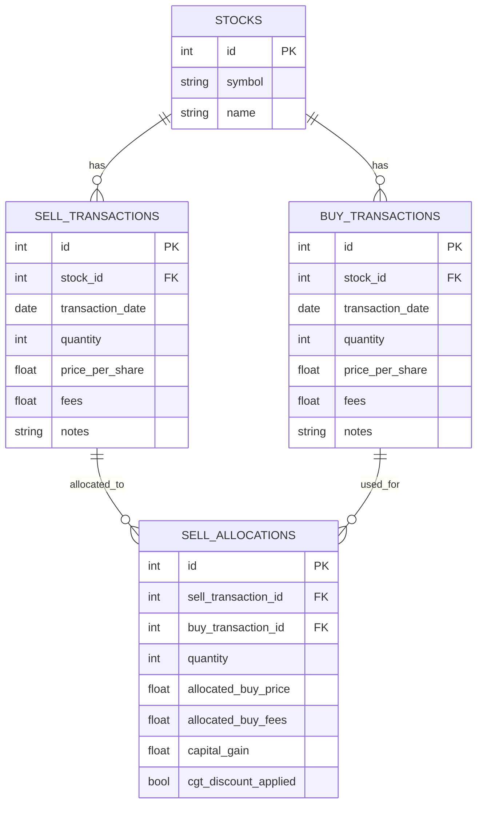
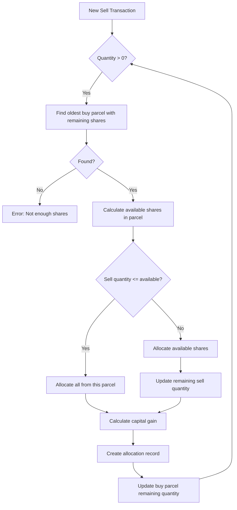

# Share Parcel Tracker - Redesign Plan

## 1. Current System Analysis

Your current application has several strengths:
- SQLite database integration for persistent storage
- CSV import functionality
- Basic transaction tracking
- Current holdings summary

However, there are limitations that need to be addressed:
- No way to link sell transactions to specific buy transactions
- No tracking of which shares from which parcels remain unsold
- Limited tax reporting capabilities
- No support for CGT discount for shares held >1 year

## 2. Core Requirements

Based on our discussion, here are the key requirements for the redesign:

**Primary Requirements:**
- Link buy and sell transactions to track unsold shares in each parcel
- Implement FIFO (First In, First Out) for automatically matching sell transactions to buy parcels
- Support Australian tax rules (50% CGT discount for shares held >1 year)
- Track capital gains/losses per financial year

**Future Extensions:**
- Manual selection of which buy parcels to sell from
- Tax optimization suggestions
- Visualization and export features

## 3. Database Schema Redesign

The current single-table approach doesn't allow for proper tracking of relationships between transactions. Here's a proposed schema redesign:



This schema:
- Separates buy and sell transactions for clarity
- Creates a many-to-many relationship through sell_allocations
- Tracks how many shares from each buy parcel were used for each sell transaction
- Records capital gains at the allocation level
- Tracks CGT discount application

## 4. Data Model Redesign

The Rust data model needs to be updated to match this new schema:

```rust
// Stock information
struct Stock {
    id: i32,
    symbol: String,
    name: Option<String>,
}

// Buy transaction (creates a parcel)
struct BuyTransaction {
    id: i32,
    stock_id: i32,
    transaction_date: Date,
    quantity: u32,
    price_per_share: f64,
    fees: f64,
    notes: Option<String>,
    // Derived
    remaining_quantity: u32, // Calculated field for reporting
}

// Sell transaction
struct SellTransaction {
    id: i32,
    stock_id: i32,
    transaction_date: Date,
    quantity: u32,
    price_per_share: f64,
    fees: f64,
    notes: Option<String>,
    // Derived
    total_capital_gain: f64, // Sum of all allocations
}

// Link between sell transaction and buy parcels
struct SellAllocation {
    id: i32,
    sell_transaction_id: i32,
    buy_transaction_id: i32,
    quantity: u32,
    allocated_buy_price: f64, // Original price × quantity
    allocated_buy_fees: f64,  // Proportional fees
    capital_gain: f64,        // Calculated gain/loss
    cgt_discount_applied: bool,
}

// For tax reporting
struct CapitalGainsSummary {
    financial_year: u32,
    short_term_gains: f64,   // Held < 1 year
    long_term_gains: f64,    // Held > 1 year
    discounted_gains: f64,   // After 50% discount
    capital_losses: f64,
    net_capital_gains: f64,  // Total taxable
}
```

## 5. FIFO Implementation

The FIFO algorithm will work as follows:



## 6. Capital Gains Calculation

For each allocation, we'll calculate:

1. Cost basis = (allocated_buy_price + allocated_buy_fees)
2. Proceeds = (sell_price_per_share × quantity - proportional_sell_fees)
3. Capital gain/loss = proceeds - cost basis
4. Apply 50% CGT discount if held > 1 year

## 7. Implementation Plan

Here's how we'll implement this redesign:

### Phase 1: Database and Core Model Refactoring
1. Update the schema to support the new model
2. Implement data migration from the old schema
3. Update the basic CRUD operations for the new model

### Phase 2: FIFO Implementation
1. Implement the FIFO allocation algorithm
2. Add functionality to automatically allocate sell transactions when imported
3. Calculate and store capital gains information

### Phase 3: Reporting
1. Implement current holdings report (similar to existing)
2. Add detailed parcel report showing remaining shares in each buy parcel
3. Create capital gains reporting by financial year
4. Add transaction-level gains/losses reporting

### Phase 4: Future Enhancements
1. Add UI for manual allocation (adjust the automatic FIFO allocations)
2. Implement tax optimization suggestions
3. Add visualization and export features

## 8. Technical Implementation Details

Here are some specific technical details for implementation:

### Database Schema Creation

```sql
-- Create tables for the new schema
CREATE TABLE stocks (
    id INTEGER PRIMARY KEY,
    symbol TEXT NOT NULL,
    name TEXT
);

CREATE TABLE buy_transactions (
    id INTEGER PRIMARY KEY,
    stock_id INTEGER NOT NULL,
    transaction_date TEXT NOT NULL,
    quantity INTEGER NOT NULL,
    price_per_share REAL NOT NULL,
    fees REAL NOT NULL,
    notes TEXT,
    FOREIGN KEY (stock_id) REFERENCES stocks(id)
);

CREATE TABLE sell_transactions (
    id INTEGER PRIMARY KEY,
    stock_id INTEGER NOT NULL,
    transaction_date TEXT NOT NULL,
    quantity INTEGER NOT NULL,
    price_per_share REAL NOT NULL,
    fees REAL NOT NULL,
    notes TEXT,
    FOREIGN KEY (stock_id) REFERENCES stocks(id)
);

CREATE TABLE sell_allocations (
    id INTEGER PRIMARY KEY,
    sell_transaction_id INTEGER NOT NULL,
    buy_transaction_id INTEGER NOT NULL,
    quantity INTEGER NOT NULL,
    allocated_buy_price REAL NOT NULL,
    allocated_buy_fees REAL NOT NULL,
    capital_gain REAL NOT NULL,
    cgt_discount_applied INTEGER NOT NULL, -- 0=false, 1=true
    FOREIGN KEY (sell_transaction_id) REFERENCES sell_transactions(id),
    FOREIGN KEY (buy_transaction_id) REFERENCES buy_transactions(id)
);
```

### FIFO Algorithm Implementation

```rust
fn allocate_sell_transaction_fifo(conn: &Connection, sell_transaction_id: i32) -> Result<()> {
    // Get the sell transaction details
    let sell_transaction = get_sell_transaction(conn, sell_transaction_id)?;
    
    // Get the stock symbol for this sell transaction
    let stock_id = sell_transaction.stock_id;
    
    // Get all buy transactions for this stock with remaining quantity,
    // ordered by date (oldest first for FIFO)
    let buy_transactions = get_buy_transactions_with_remaining(conn, stock_id)?;
    
    let mut remaining_to_allocate = sell_transaction.quantity;
    
    for buy_tx in buy_transactions {
        if remaining_to_allocate == 0 {
            break;
        }
        
        // Calculate how much we can allocate from this buy transaction
        let available_quantity = calculate_remaining_quantity(conn, buy_tx.id)?;
        let allocation_quantity = std::cmp::min(remaining_to_allocate, available_quantity);
        
        if allocation_quantity > 0 {
            // Calculate the proportion of the original purchase this allocation represents
            let proportion = allocation_quantity as f64 / buy_tx.quantity as f64;
            
            // Calculate allocated amounts
            let allocated_buy_price = buy_tx.price_per_share * allocation_quantity as f64;
            let allocated_buy_fees = buy_tx.fees * proportion;
            
            // Calculate proportional sell amount and fees
            let allocated_sell_price = sell_transaction.price_per_share * allocation_quantity as f64;
            let allocated_sell_fees = sell_transaction.fees * 
                (allocation_quantity as f64 / sell_transaction.quantity as f64);
            
            // Calculate capital gain/loss
            let cost_basis = allocated_buy_price + allocated_buy_fees;
            let proceeds = allocated_sell_price - allocated_sell_fees;
            let capital_gain = proceeds - cost_basis;
            
            // Check if CGT discount applies (held for more than 1 year)
            let cgt_discount_applied = is_eligible_for_cgt_discount(
                &buy_tx.transaction_date, 
                &sell_transaction.transaction_date
            );
            
            // Create allocation record
            create_sell_allocation(
                conn,
                sell_transaction_id,
                buy_tx.id,
                allocation_quantity,
                allocated_buy_price,
                allocated_buy_fees,
                capital_gain,
                cgt_discount_applied,
            )?;
            
            // Update remaining quantity to allocate
            remaining_to_allocate -= allocation_quantity;
        }
    }
    
    // Check if we've allocated all shares
    if remaining_to_allocate > 0 {
        return Err(anyhow::anyhow!("Not enough shares in buy transactions to allocate sell transaction"));
    }
    
    Ok(())
}

fn is_eligible_for_cgt_discount(buy_date: &Date, sell_date: &Date) -> bool {
    // Calculate difference in days between dates
    // (This would need a proper date library implementation)
    let days_between = days_between_dates(buy_date, sell_date);
    
    // Check if held for more than 1 year (365 days)
    days_between > 365
}
```

### Remaining Quantity Calculation

```rust
fn calculate_remaining_quantity(conn: &Connection, buy_transaction_id: i32) -> Result<u32> {
    // Get the original quantity from the buy transaction
    let original_quantity: u32 = conn.query_row(
        "SELECT quantity FROM buy_transactions WHERE id = ?1",
        params![buy_transaction_id],
        |row| row.get(0)
    )?;
    
    // Sum all allocations for this buy transaction
    let allocated_quantity: u32 = conn.query_row(
        "SELECT COALESCE(SUM(quantity), 0) FROM sell_allocations WHERE buy_transaction_id = ?1",
        params![buy_transaction_id],
        |row| row.get(0)
    )?;
    
    Ok(original_quantity - allocated_quantity)
}
```

### Capital Gains Reporting

```rust
fn generate_capital_gains_summary(conn: &Connection, financial_year: u32) -> Result<CapitalGainsSummary> {
    // Find all sell allocations in this financial year
    let mut stmt = conn.prepare(
        "SELECT sa.capital_gain, sa.cgt_discount_applied
         FROM sell_allocations sa
         JOIN sell_transactions st ON sa.sell_transaction_id = st.id
         WHERE strftime('%Y', st.transaction_date) = ?1
           OR (strftime('%Y', st.transaction_date) = ?2 AND strftime('%m', st.transaction_date) <= '06')"
    )?;
    
    let allocations = stmt.query_map(
        params![financial_year.to_string(), (financial_year + 1).to_string()],
        |row| {
            let capital_gain: f64 = row.get(0)?;
            let cgt_discount_applied: bool = row.get(1)?;
            Ok((capital_gain, cgt_discount_applied))
        }
    )?;
    
    let mut short_term_gains = 0.0;
    let mut long_term_gains = 0.0;
    let mut capital_losses = 0.0;
    
    for result in allocations {
        let (gain, discount_eligible) = result?;
        
        if gain > 0.0 {
            if discount_eligible {
                long_term_gains += gain;
            } else {
                short_term_gains += gain;
            }
        } else {
            capital_losses += -gain; // Convert to positive for reporting
        }
    }
    
    // Apply 50% discount to long-term gains
    let discounted_gains = long_term_gains * 0.5;
    
    // Calculate net capital gains (losses can offset gains)
    let total_gains = short_term_gains + discounted_gains;
    let net_capital_gains = if total_gains > capital_losses {
        total_gains - capital_losses
    } else {
        0.0 // Capital losses can only offset gains, not other income
    };
    
    Ok(CapitalGainsSummary {
        financial_year,
        short_term_gains,
        long_term_gains,
        discounted_gains,
        capital_losses,
        net_capital_gains,
    })
}
```

## 9. Benefits of the Redesigned Solution

1. **Accurate Tracking**: Properly tracks which shares from which parcels have been sold and which remain.

2. **Tax Compliance**: Supports Australian tax requirements including the 50% CGT discount.

3. **Flexibility**: The design allows for both automatic (FIFO) and future manual allocation.

4. **Transparency**: Clear reporting of capital gains/losses and remaining holdings.

5. **Extensibility**: The architecture supports adding more features in the future.

## 10. Design Considerations and Tradeoffs

1. **Complexity vs. Functionality**: The redesign adds complexity but provides essential functionality for proper share tracking and tax reporting.

2. **Performance**: Separating buy and sell transactions may slightly impact performance for large datasets, but the benefits outweigh this concern.

3. **Migration Strategy**: We'll need to migrate existing data to the new schema, which requires careful implementation.